## 🖼️ Project Banner

  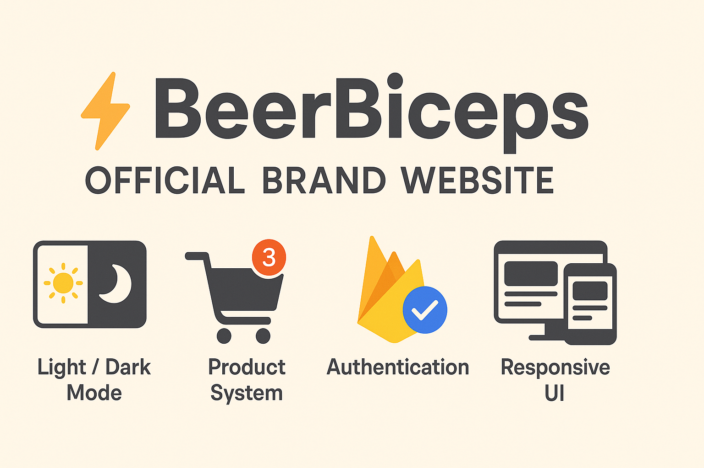

# ⚡ BeerBiceps Official Brand Website

A professional and interactive brand website for **BeerBiceps (Ranveer Allahbadia)** — showcasing his journey, digital products, and online presence. Built using modern frontend technologies with elegant UI/UX and full mobile responsiveness.

---

## 🚀 Highlights

- 📱 **Responsive UI** – Flawless experience across all devices  
- 🌓 **Light/Dark Mode** – Toggle-friendly modern theming  
- 🛒 **Product System** – Add to cart with quantity badge and cart page  
- 🔐 **Authentication** – Firebase Email/Password + Google login  
- 📈 **About Section** – Animated follower stats with Framer Motion  
- ✉️ **Contact Page** – Clean, validated contact form  
- 🎯 **Smooth Transitions** – Page animations for polished navigation  

---

## ⚙️ Tech Stack

| Frontend      | Styling        | Animations      | Backend/Auth     |
|---------------|----------------|------------------|------------------|
| React.js      | SCSS Modules   | Framer Motion   | Firebase Auth     |
| React Router  | CSS Variables  | Page Transitions| Firebase SDK      |

---

## 🧠 Folder Structure

/src
├── components/ → Navbar, Footer, Product Cards, etc.
├── context/ → CartContext API
├── firebase.js → Firebase configuration
├── pages/ → Home, About, Products, Contact, Login, Signup
├── styles/ → Global SCSS & theme variables
└── App.js → App with routing and layout

---

## 🛠 Getting Started Locally

1. **Clone the repository:**

git clone https://github.com/Chandrakanth1601/beerbiceps-website
cd beerbiceps-website

2. **Install dependencies:**

npm install

3. **Start development server:**

npm start

4. **Access the app locally at:**

http://localhost:3000

## 🔐 Firebase Setup (Required)

1. Go to [Firebase Console](https://console.firebase.google.com/)
2. Create a new project
3. Enable **Email/Password** and **Google Sign-In** in Authentication
4. Copy your Firebase config and paste it into `firebase.js` like this:

import { initializeApp } from "firebase/app";
import { getAuth, GoogleAuthProvider } from "firebase/auth";

const firebaseConfig = {
  apiKey: "YOUR-API-KEY",
  authDomain: "YOUR-DOMAIN.firebaseapp.com",
  projectId: "YOUR-ID",
  storageBucket: "YOUR.appspot.com",
  messagingSenderId: "SENDER-ID",
  appId: "APP-ID"
};

const app = initializeApp(firebaseConfig);
export const auth = getAuth(app);
export const googleProvider = new GoogleAuthProvider();

## 🔗 Live Demo

👉 beerbiceps-website.vercel.app

## 📸 Screenshots

💻 Desktop View (Light & Dark Mode)
Home (Light)	Home (Dark)
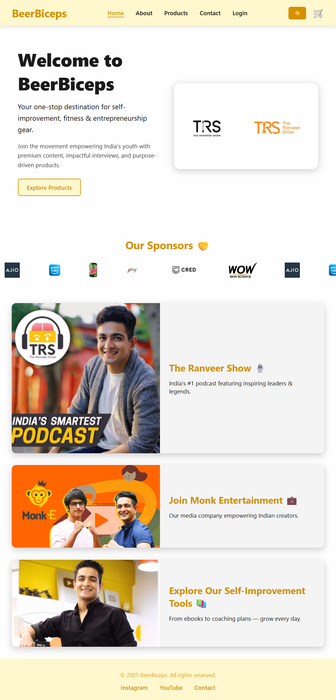	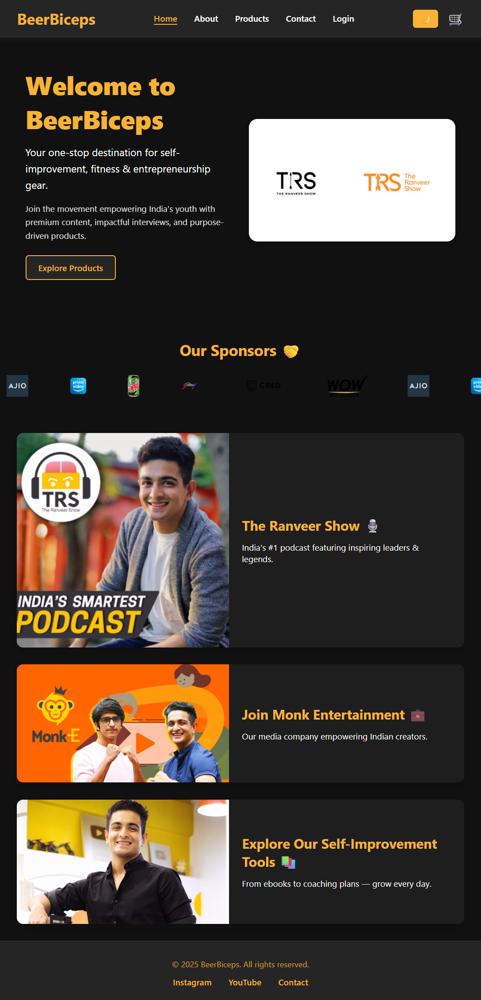

About (Light)	About (Dark)
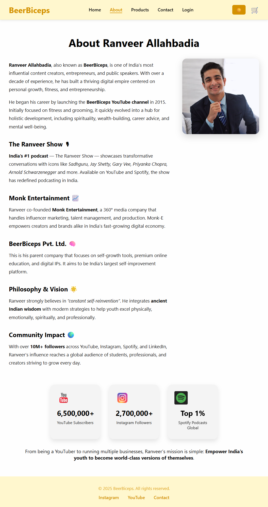	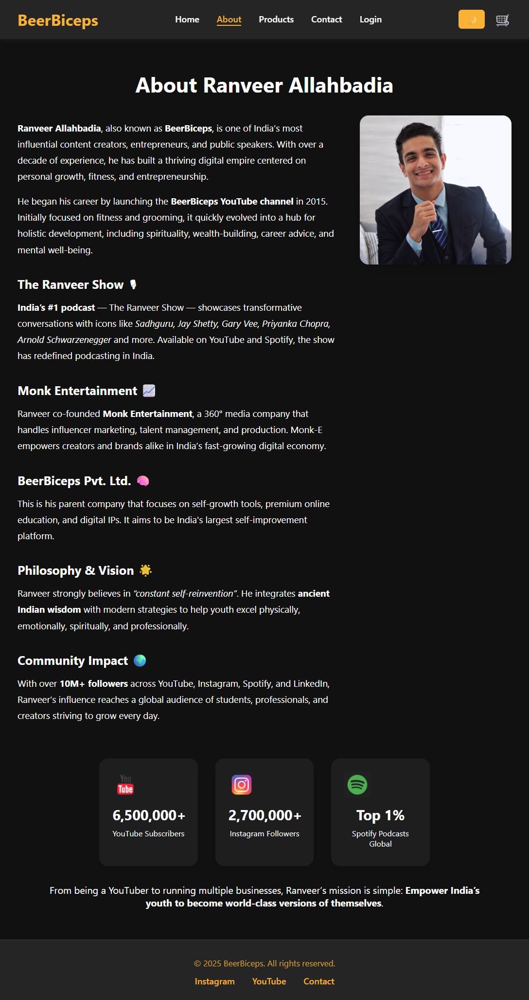

Products (Light)	Products (Dark)
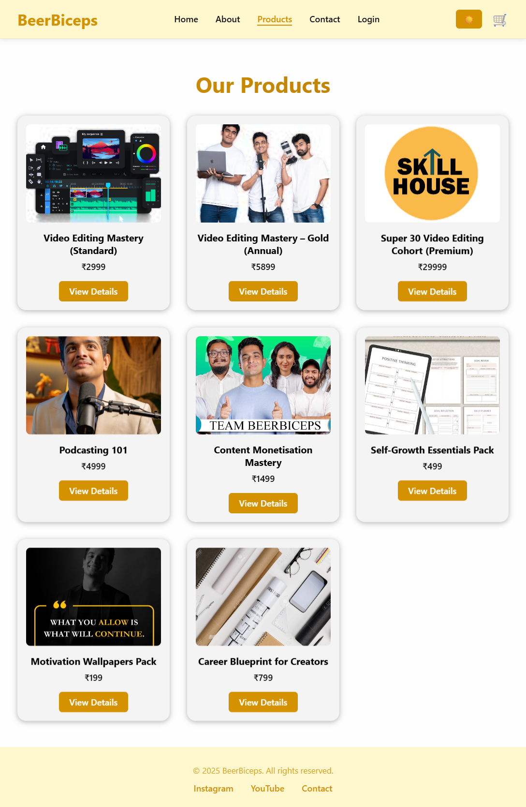	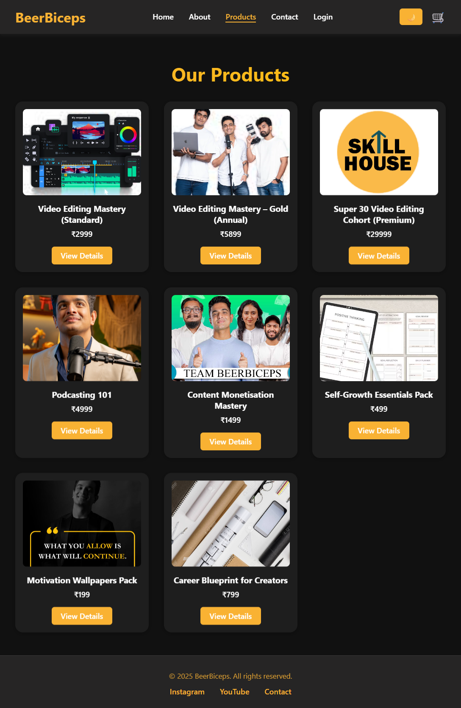

Contact (Light)	Contact (Dark)
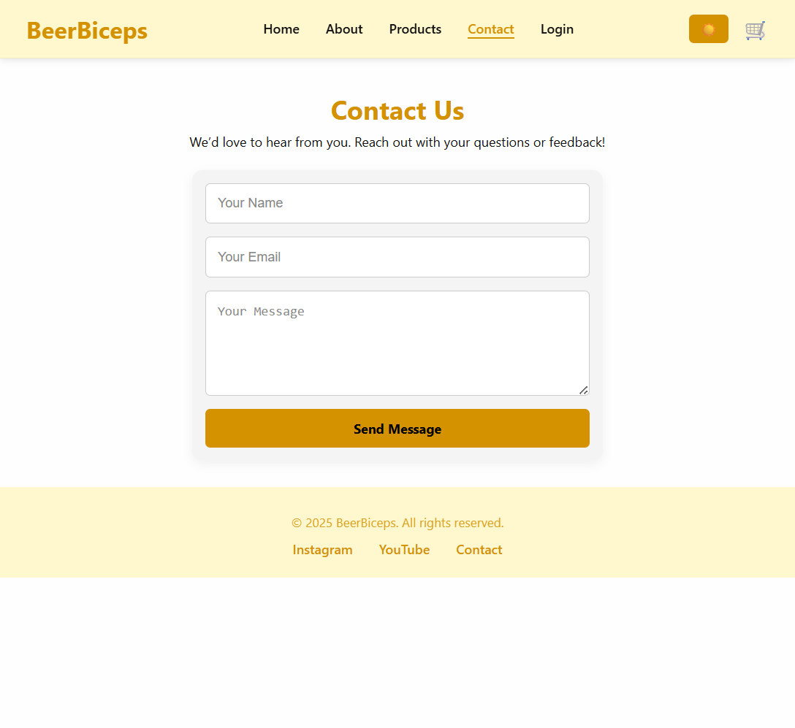	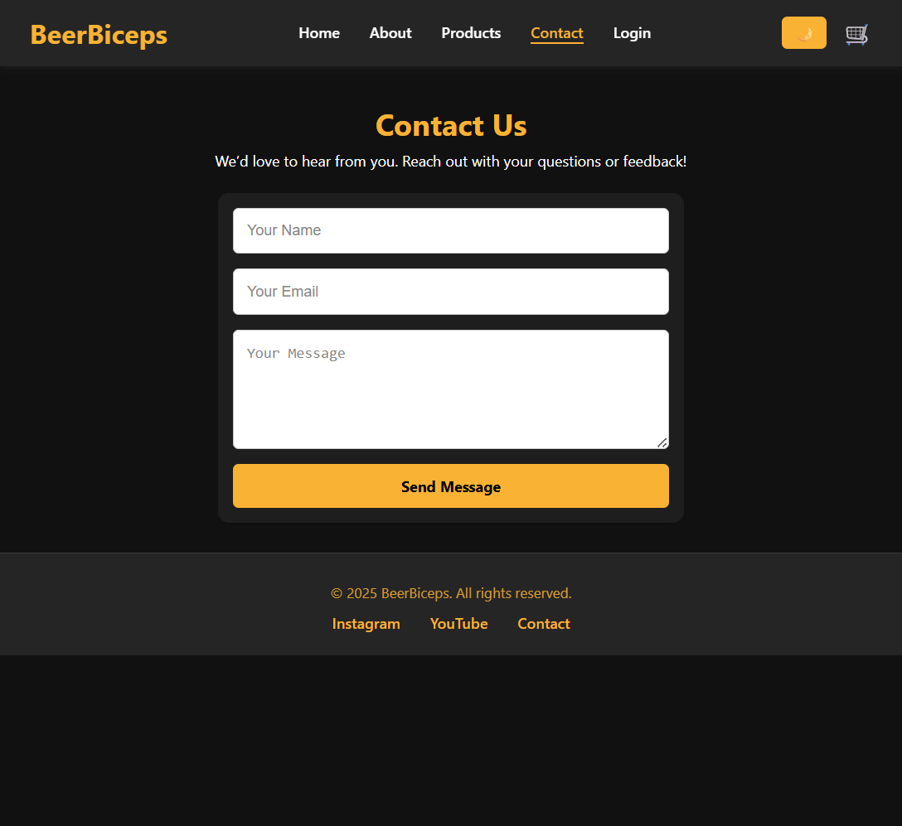

Login (Light)	Login (Dark)
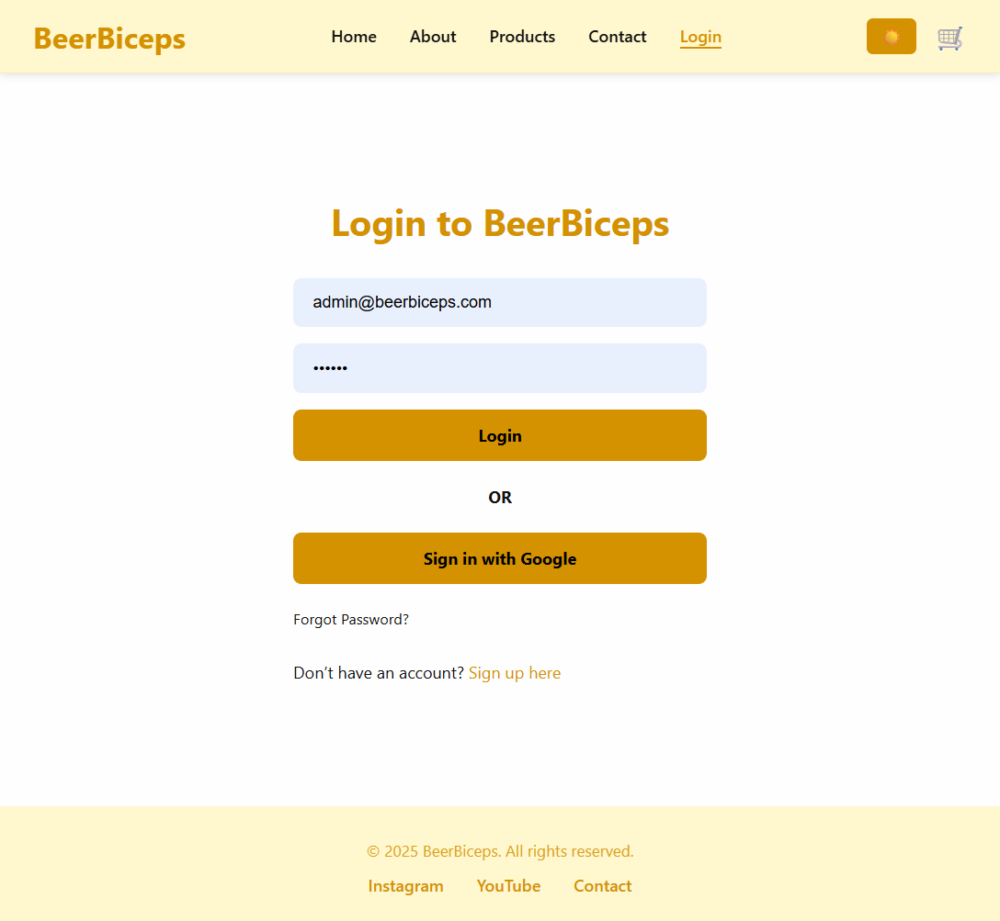	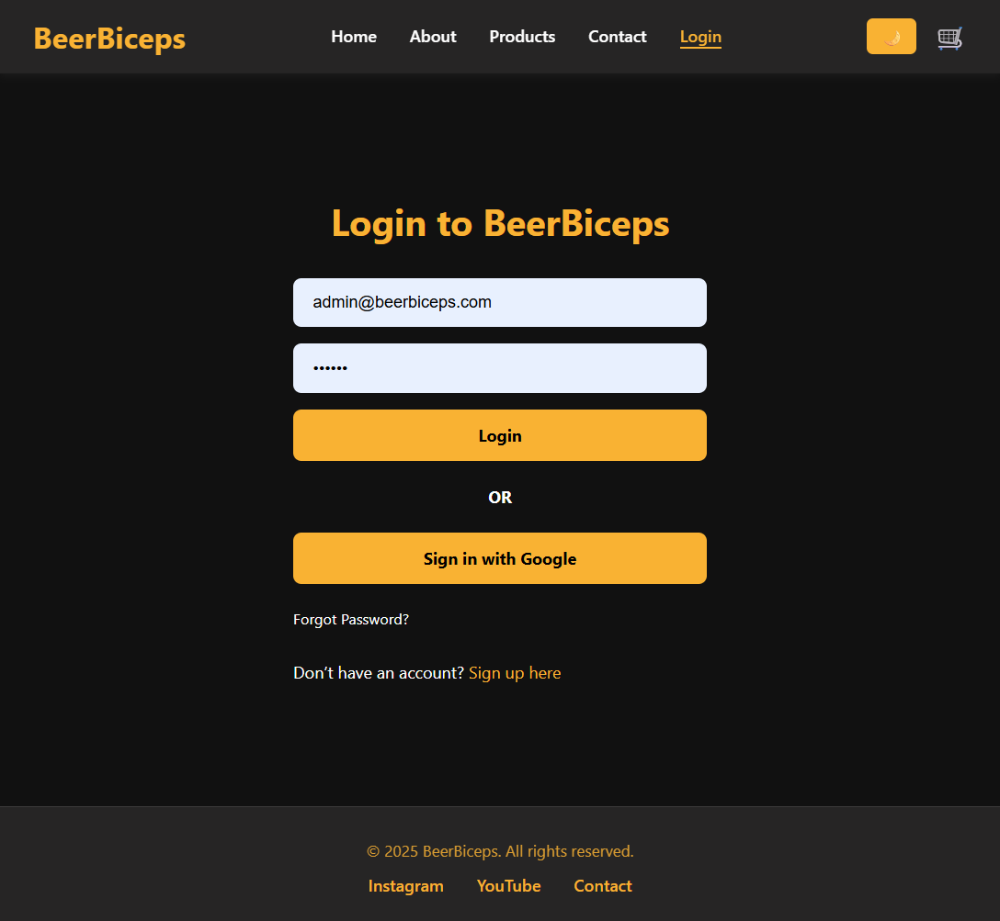
------------------------------------------------------------------------------------------------------------------------------------------
📱 Mobile View (Light & Dark Mode)

Mobile Home (Light)	Mobile Home (Dark)
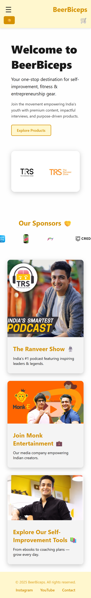	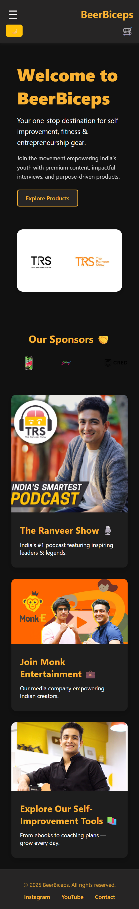

Mobile About (Light)	Mobile About (Dark)
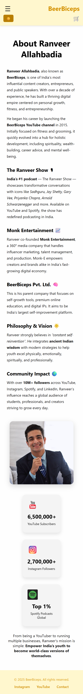	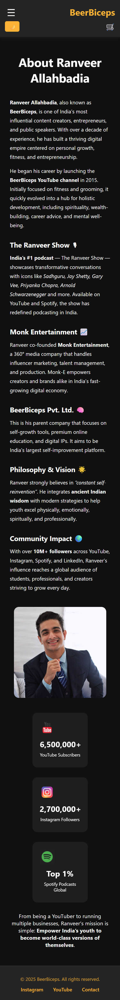

Mobile Products (Light)	Mobile Products (Dark)
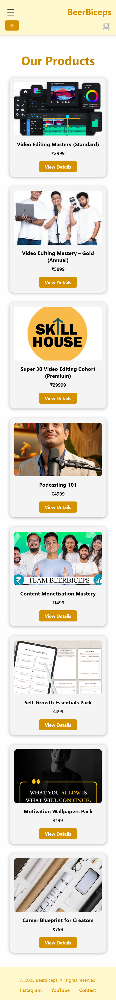	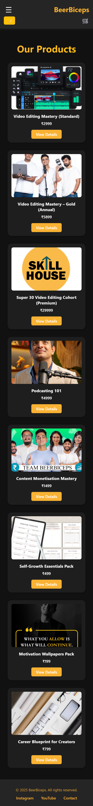

Mobile Contact (Light)	Mobile Contact (Dark)
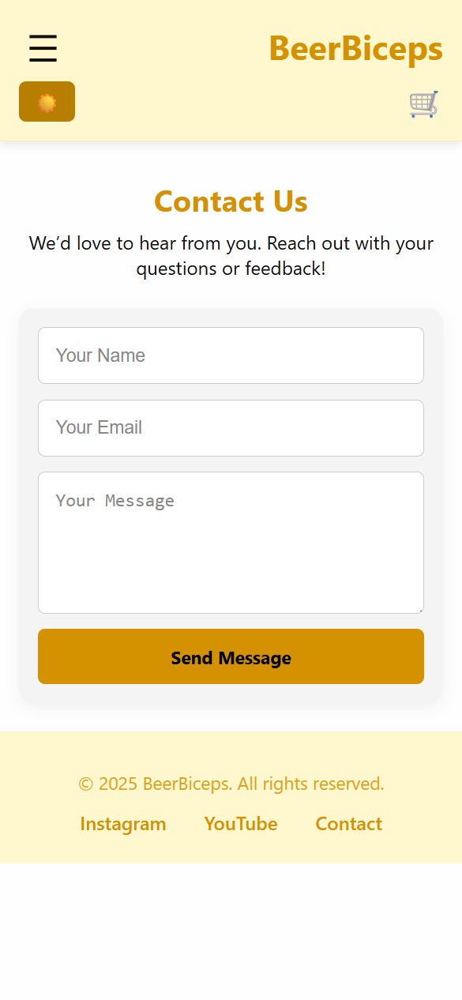	

Mobile Login (Light)	Mobile Login (Dark)
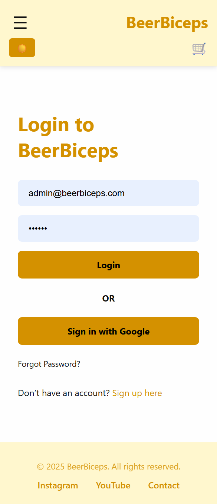	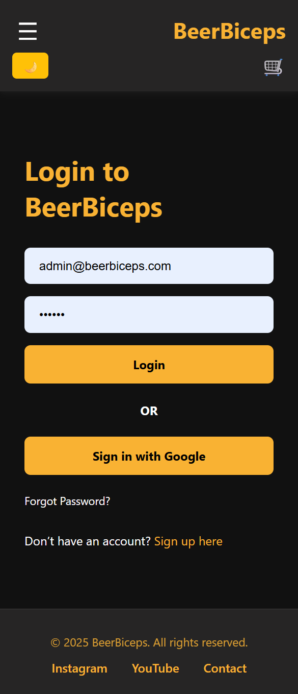

## 📬Contact

Feel free to reach out via the Contact Page of the website
or connect with me on GitHub!

## 🤝 Credits
Built with 💻 by T Chandrakanth

🎓 Submitted as part of the Sheryians Coding Hackathon

Inspired by the incredible journey of Ranveer Allahbadia (BeerBiceps)
